# Dark Wing: Institutional Quantitative Statistical Arbitrage Engine

[](https://www.python.org/downloads/)
[](https://opensource.org/licenses/MIT)
[](tests/)
[](#system-pipeline-architecture)

**Dark Wing** is an institutional-grade algorithmic trading and quantitative research framework engineered for statistical arbitrage, cointegration-based pairs trading, and multi-asset basket mean reversion. It combines econometric rigor with state-space signal processing, dynamic recursive Bayesian filtering, multi-barrier risk controls, and automated broker execution across global equity markets (US, Europe, Asia-Pacific).

---

## Theoretical Foundation & Research Notes

The underlying mathematical derivations, econometric assumptions, and empirical protocols are comprehensively documented in the accompanying research notes:
* **Research Knowledge Base**: [Stationarity Test & Time Series Analysis Notes](https://app.notion.com/p/Stationarity-Test-3a893de17f3d800e9c63eaa01bdf2abb)
  * *Location*: Page **"Stationarity Test"** inside the **Introduction** database of **Time series analysis**.
  * *Topics Covered*: Unit root testing (ADF, KPSS, Phillips-Perron), cointegration rank determination (Johansen MLE trace/max-eigenvalue), Vector Error Correction Models (VECM), discrete-time Kalman filtering, Rauch-Tung-Striebel (RTS) backward smoothing, and continuous-time Ornstein-Uhlenbeck (OU) mean-reverting jump-diffusion dynamics.

---

## System Pipeline Architecture

The quantitative engine operates as a sequential, multi-stage pipeline where each phase transforms raw non-stationary asset prices into stationary, risk-controlled, executable trade orders.

```mermaid
flowchart TD
    subgraph S1["Stage 1: Market Data & Econometric Validation"]
        MD["Raw Tick / Bar Market Data\n(yfinance / IBKR TWS / Angel One)"]
        ST["Dual Stationarity Verification\n(ADF τ-stat + KPSS LM test)\nCheck I(1) integration order"]
        LS["VAR Optimal Lag Selection\n(AIC / BIC / HQIC / FPE)\nLag order p* selection"]
        MD --> ST
        ST --> LS
    end

    subgraph S2["Stage 2: Cointegration & VECM Equilibrium"]
        EG["Engle-Granger Two-Step\n(Pairs: OLS + Residual ADF)"]
        JH["Johansen Rank MLE\n(Baskets/Pairs: Trace & Max-Eigen)\nExtracts Cointegrating Vectors β"]
        VECM["Vector Error Correction Model\nΔY_t = Π Y_{t-1} + Σ Γ_i ΔY_{t-i} + ε_t\nα = Speed of Adjustment, ECT = Spread"]
        DIAG["VECM Residual Diagnostics\n(Portmanteau Whiteness, ARCH LM,\nJarque-Bera Normality, Split Stability)"]
        LS --> EG
        LS --> JH
        JH --> VECM
        VECM --> DIAG
    end

    subgraph S3["Stage 3: State-Space Filtering & Spread Dynamics"]
        SB["Spread Construction\nS_t = Y_t - β_t·X_t - α"]
        KF["Kalman Filter (Online β_t)\nState: β_t = β_{t-1} + η_t\nObservation: Y_t = β_t·X_t + ε_t\nUpdate: G_t Kalman Gain, P_{t|t} Cov"]
        RTS["RTS Backward Smoother\nβ_{t|T} offline optimal inference\nRegime break & parameter tuning"]
        HL["Ornstein-Uhlenbeck Dynamics\ndS_t = κ(μ - S_t)dt + σ dW_t\nHalf-Life: τ_HL = ln(2)/κ"]
        ZS["Adaptive Z-Score Normalization\nZ_t = (S_t - μ_t) / σ_t\nRolling vs Expanding Lookback (2·τ_HL)"]
        EG --> SB
        DIAG --> SB
        SB --> KF
        KF --> RTS
        KF --> HL
        HL --> ZS
    end

    subgraph S4["Stage 4: Signal Generation & Regime Filtering"]
        PSG["PairSignalGenerator\nThresholds: |Z_t| > entry_z, exit_z, stop_z\nCUSUM Filter: Mean-shift detection\nKalman Forecaster: Multi-step trajectory"]
        MPSA["MultiPairSignalAggregator\nInverse-variance portfolio allocation\nCross-pair correlation & consensus"]
        ZS --> PSG
        PSG --> MPSA
    end

    subgraph S5["Stage 5: Quantitative Risk & Portfolio Sizing"]
        PS["Position Sizing Engine\nFractional Kelly Criterion (f* / 4)\nVolatility-Targeted Sizing\nBeta-Neutral Dollar Balancing"]
        SL["5-Barrier Stop-Loss Controller\n1. Z-Score Divergence (|Z| > stop_z)\n2. Hard Dollar Drawdown Cap\n3. Spread-Volatility Expansion (k·σ)\n4. Ornstein-Uhlenbeck Time Stop (3·τ_HL)\n5. Trailing Profit Stop + Cooldown Delay"]
        PSG --> PS
        PSG --> SL
        MPSA --> PS
    end

    subgraph S6["Stage 6: Simulation, Auditing & Live Execution"]
        BT["Backtest Engine\nBar-by-bar event-driven simulation\nSlippage & transaction cost modeling"]
        WF["Walk-Forward Optimization\nExpanding window OOS evaluation\nParameter freeze & degradation checks"]
        PA["Performance & Tail Risk Analytics\nSharpe, Sortino, Calmar, MaxDD\nParametric & Historical VaR / CVaR (95%/99%)"]
        EXEC_IBKR["IBKR Executor\nInteractive Brokers TWS API Socket\nBracket orders, audit trade logging"]
        EXEC_ANGEL["Angel One Executor\nSmartAPI REST/WebSocket engine\nNSE/BSE Indian equities execution"]
        PS --> BT
        SL --> BT
        BT --> WF
        BT --> PA
        PS --> EXEC_IBKR
        SL --> EXEC_IBKR
        PS --> EXEC_ANGEL
        SL --> EXEC_ANGEL
    end

    style S1 fill:#161b22,stroke:#30363d,stroke-width:1px,color:#c9d1d9
    style S2 fill:#1f242c,stroke:#388bfd,stroke-width:1px,color:#c9d1d9
    style S3 fill:#1c2536,stroke:#1f6feb,stroke-width:1px,color:#c9d1d9
    style S4 fill:#1a2b25,stroke:#238636,stroke-width:1px,color:#c9d1d9
    style S5 fill:#2d1d24,stroke:#da3633,stroke-width:1px,color:#c9d1d9
    style S6 fill:#261e38,stroke:#8957e5,stroke-width:1px,color:#c9d1d9
```



---

## Project Structure

```text
Dark Wing/
├── Backtesting/                                      # Event-driven backtesting and validation suite
│   ├── engine.py                                     # Core simulation loop with slippage and commission
│   ├── performance.py                                # Institutional performance, drawdown, and VaR/CVaR metrics
│   └── walkforward.py                                # Expanding-window walk-forward out-of-sample validator
├── Financial_Mathematics/                            # Mathematical modeling, econometrics, and state-space
│   ├── Temporary/
│   │   └── strategy_comparison.py                   # Multi-strategy benchmark (Pairs vs Bollinger vs RSI vs B&H)
│   ├── Time_Series_Analysis/
│   │   ├── Cointegration_Tests/
│   │   │   ├── engle_granger.py                      # Two-step Engle-Granger residual cointegration test
│   │   │   ├── johansen.py                           # Johansen MLE cointegration test for pairs and baskets
│   │   │   └── rolling_cointegration.py              # Time-varying cointegration stability and breakdown tracking
│   │   ├── Kalman_Filter/
│   │   │   ├── KF practise/                          # Sandbox prototypes and early experimental scripts
│   │   │   │   ├── KF_pr.py                          # Experimental bivariate/multivariate Kalman implementation
│   │   │   │   └── complete_kalman_filter.py         # Univariate Kalman filter prototype with MLE tuning
│   │   │   ├── dynamic_beta.py                       # High-level pipeline connecting Kalman hedge ratios to spreads
│   │   │   ├── kalman_filter.py                      # Production KalmanFilterPairs with online state updates
│   │   │   ├── kalman_forecast.py                    # Multi-step ahead Kalman forecast with growing confidence intervals
│   │   │   ├── smoother.py                           # Rauch-Tung-Striebel (RTS) backward state smoother
│   │   │   └── vecm_forecast.py                      # VECM dynamic equilibrium forecaster
│   │   ├── Spreads/
│   │   │   ├── half_life.py                          # Ornstein-Uhlenbeck mean-reversion half-life estimator
│   │   │   ├── spread_builder.py                     # Synthetic spread series constructor (OLS, fixed, Johansen ECT)
│   │   │   └── zscore.py                             # Rolling/expanding dimensionless Z-score normalizer
│   │   └── Stationarity_Tests/
│   │       ├── ADF_Test.py                           # Pure NumPy Augmented Dickey-Fuller implementation
│   │       └── TS_stationarity_test.py               # Combined ADF + KPSS dual stationarity verification
│   ├── VECM/
│   │   ├── diagnostics.py                            # VECM post-estimation validation (Whiteness, ARCH, Stability)
│   │   └── fit_vecm.py                               # Vector Error Correction Model fitting and ECT extraction
│   └── Vector_Auto_Regressive/
│       ├── VAR_Lag_Select.py                         # Multi-criteria information criterion lag selection
│       └── lag_selection_report.py                   # Standalone VAR lag selector with automated summary reports
├── Trade_Implement/                                  # Signal logic, portfolio risk, and execution drivers
│   ├── Executor/
│   │   ├── angel_executor.py                         # Angel One SmartAPI live/paper order execution client
│   │   └── ibkr_executor.py                          # Interactive Brokers TWS live/paper execution engine
│   ├── IBKR_Implement/
│   │   ├── IBKR TWS_Application.py                   # Low-level EClient/EWrapper market data and order script
│   │   ├── IBKR_Connection.py                        # Thread-safe TWS connection manager with auto-reconnect
│   │   ├── IBKR_MarketData.py                        # Real-time and historical bar streaming and Excel exporter
│   │   ├── IBKR_implement.py                         # Standalone market data snapshot verification script
│   │   └── IBKR_testing.py                           # Historical tick and bar request verification script
│   ├── Risk_Management/
│   │   ├── position_sizing.py                        # Fractional Kelly, volatility targeting, and capital bounds
│   │   └── stoploss.py                               # 5-barrier risk manager (Z-score, dollar, vol, time, trailing)
│   └── Signals/
│       ├── multi_pair_signal.py                      # Cross-pair inverse-variance signal aggregator
│       └── pair_signal.py                            # Pair signal generator with CUSUM and Kalman confirmation
├── tests/                                            # Continuous integration and unit test suite
│   ├── __init__.py
│   └── test_core.py                                  # Unit tests for spread math, half-life, VaR/CVaR, Kelly, stops
├── pipeline.mmd                                      # High-level pipeline flowchart specification
├── financial signal.mmd                              # Component connectivity diagram
├── run_paper_trade.py                                # End-to-end multi-market daily swing paper trading runner
├── verify_imports.py                                 # Import path verification helper
├── pytest.ini                                        # Pytest configuration (testpaths, ignored directories)
├── .gitignore                                        # Repository hygiene and artifact exclusions
└── requirements.txt                                  # Production library dependencies
```

---

## Detailed Module & File Guide

### 1. Root Orchestrators & Entrypoints

* **`run_paper_trade.py`**:
  * **Role**: Primary production execution runner for daily statistical arbitrage across global equity pairs.
  * **Features**: Houses predefined institutional pairs across 9 major exchanges (`US`: KO/PEP, `JAPAN`: 7203/7267, `GERMANY`: BMW/MBG, `FRANCE`: BNP/GLE, `UK`: SHEL/BP, `INDIA`: RELIANCE/TCS, `CANADA`: RY/TD, `AUSTRALIA`: BHP/RIO, `HONG_KONG`: 0992/0700). Fetches auto-adjusted historical daily bars, constructs the state-space dynamic beta, computes the Ornstein-Uhlenbeck half-life, derives adaptive Z-scores, checks multi-barrier stops, calculates Kelly position sizing, and triggers paper orders via `IBKRExecutor`.
* **`verify_imports.py`**:
  * **Role**: System verification utility that dynamically validates module paths and imports without executing trading routines.

---

### 2. Financial Mathematics & Econometrics

#### A. Stationarity Testing (`Financial_Mathematics/Time_Series_Analysis/Stationarity_Tests/`)
* **`TS_stationarity_test.py` (`StationarityTest`)**:
  * **Role**: Enforces econometric rigor by applying a dual-test protocol on time series:
    1. **Augmented Dickey-Fuller (ADF)**: Tests $H_0$: Series possesses a unit root (non-stationary) vs. $H_1$: Series is stationary.
    2. **KPSS Test**: Tests $H_0$: Series is level/trend stationary vs. $H_1$: Series possesses a unit root.
  * **Significance**: Confirms whether an asset price series is integrated of order $I(1)$ and whether its return/spread series is strictly $I(0)$.
* **`ADF_Test.py` (`ADF_Test`)**:
  * **Role**: A standalone, from-scratch OLS regression implementation of the Augmented Dickey-Fuller test. Computes the $\tau$-statistic ($\hat{\delta} / \text{SE}(\hat{\delta})$), optimal lag selection via AIC minimization, MacKinnon critical value interpolation, and approximate $p$-values across three regression variants (no constant, constant only, constant with linear trend).

#### B. Vector Autoregression & Lag Selection (`Financial_Mathematics/Vector_Auto_Regressive/`)
* **`VAR_Lag_Select.py` (`VAROptimalLagSelect`)**:
  * **Role**: Determines the optimal autoregressive lag order $p^*$ for multivariate series prior to cointegration testing.
  * **Metrics**: Evaluates Akaike Information Criterion (AIC), Schwarz Bayesian Information Criterion (BIC/SC), Hannan-Quinn Information Criterion (HQIC), and Final Prediction Error (FPE). Produces penalty criteria plots and residual covariance estimates $\hat{\Sigma}_\mu$.
* **`lag_selection_report.py` (`VARLagSelector`)**:
  * **Role**: Alternative VAR lag selection implementation providing clean formatted metric reports and log-transformation pipelines.

#### C. Cointegration Testing (`Financial_Mathematics/Time_Series_Analysis/Cointegration_Tests/`)
* **`engle_granger.py` (`EngleGrangerTest`)**:
  * **Role**: Classical two-step cointegration test for bivariate pairs ($Y_t, X_t$).
    * *Step 1*: Runs OLS regression $Y_t = \alpha + \beta X_t + \varepsilon_t$ to estimate the static hedge ratio $\beta$.
    * *Step 2*: Runs ADF unit root test on the estimated residuals $\hat{\varepsilon}_t$. Confirms whether the linear combination is stationary $I(0)$.
* **`johansen.py` (`JohansenTest`)**:
  * **Role**: Maximum likelihood cointegration procedure for pairs and multi-asset baskets ($m \ge 2$). Solves the generalized eigenvalue problem on canonical correlations of residual matrices:
    $$\left|\lambda S_{kk} - S_{k0} S_{00}^{-1} S_{0k}\right| = 0$$
  * **Output**: Computes Trace and Maximum-Eigenvalue statistics across rank hypotheses $r = 0, 1, \dots, m-1$ to extract the full matrix of cointegrating vectors $\beta$.
* **`rolling_cointegration.py` (`RollingCointegration`)**:
  * **Role**: Sliding-window cointegration tracker. Detects structural breaks and cointegration degradation over rolling horizons (e.g., 252 bars). Generates a "Cointegration Stability Score" (percentage of time windows rejecting the unit-root null) to verify whether a pair is statistically viable for live deployment.

#### D. Vector Error Correction Model (`Financial_Mathematics/VECM/`)
* **`fit_vecm.py` (`VECMModel`)**:
  * **Role**: Fits the full dynamic Vector Error Correction Model:
    $$\Delta Y_t = \Pi Y_{t-1} + \sum_{i=1}^{p-1} \Gamma_i \Delta Y_{t-i} + \Phi D_t + \varepsilon_t$$
    where $\Pi = \alpha \beta'$ decomposes into the speed of adjustment matrix $\alpha$ and cointegrating vectors $\beta$.
  * **Output**: Extracts the stationary Error Correction Term (ECT), which serves as the fundamental spread for mean-reversion trading.
* **`diagnostics.py` (`VECMDiagnostics`)**:
  * **Role**: Econometric sanity checker for fitted VECM models. Performs Portmanteau Whiteness test (autocorrelation check), Doornik-Hansen normality test, ARCH-LM conditional heteroskedasticity test, ECT stationarity verification, and split-sample parameter stability testing. Outputs a consolidated VECM Health Score.

#### E. Spread Engineering (`Financial_Mathematics/Time_Series_Analysis/Spreads/`)
* **`spread_builder.py` (`SpreadBuilder`)**:
  * **Role**: Unified spread generation interface supporting three modes:
    1. `ols`: Two-asset pair spread using static OLS hedge ratio ($S_t = Y_t - \alpha - \beta X_t$).
    2. `fixed_beta`: Two-asset pair spread with user-provided hedge ratio (e.g. from Kalman filter).
    3. `johansen_ect`: Multi-asset portfolio spread computed via inner product of the price matrix and cointegrating vector ($S_t = \text{Data} \times \beta$).
* **`half_life.py` (`HalfLife`)**:
  * **Role**: Fits a continuous-time Ornstein-Uhlenbeck (OU) mean-reverting stochastic differential equation:
    $$dS_t = \kappa (\mu - S_t) dt + \sigma dW_t$$
    Discretized via OLS as $\Delta S_t = a + b S_{t-1} + \varepsilon_t$, with mean-reversion speed $\kappa = -\ln(1+b)/\Delta t$ and expected half-life $\tau_{HL} = \ln(2)/\kappa$. Computes 95% confidence intervals via the Delta method.
* **`zscore.py` (`ZScore`)**:
  * **Role**: Converts unscaled spreads into a standardized, dimensionless signal:
    $$Z_t = \frac{S_t - \mu_t}{\sigma_t}$$
    Supports adaptive rolling windows (tuned to $2 \times \tau_{HL}$) and expanding historical windows. Generates entry ($|Z| > 2.0$), exit ($|Z| < 0.5$), and hard stop ($|Z| > 3.5$) trigger boundaries.

#### F. Kalman Filtering & Dynamic State-Space (`Financial_Mathematics/Time_Series_Analysis/Kalman_Filter/`)
* **`kalman_filter.py` (`KalmanFilterPairs`)**:
  * **Role**: Online recursive Bayesian estimator for time-varying hedge ratios ($\beta_t$).
    * *State Equation*: $\beta_t = \beta_{t-1} + \eta_t, \quad \eta_t \sim \mathcal{N}(0, Q)$
    * *Observation Equation*: $Y_t = X_t \beta_t + \varepsilon_t, \quad \varepsilon_t \sim \mathcal{N}(0, R)$
  * **Recursion**: Calculates prior state prediction, innovation residual, Kalman gain $G_t$, posterior state update, and covariance update. Includes Maximum Likelihood Estimation (MLE) of process noise $Q$ and measurement noise $R$.
* **`smoother.py` (`KalmanSmoother`)**:
  * **Role**: Rauch-Tung-Striebel (RTS) backward smoother. Uses the complete sample history $T$ to compute the minimum-variance offline state estimate $\beta_{t|T} = \mathbb{E}[\beta_t | Y_1, \dots, Y_T]$. Essential for post-hoc parameter tuning, backtesting analysis, and structural break detection.
* **`dynamic_beta.py` (`DynamicBeta`)**:
  * **Role**: High-level orchestrator chaining `SpreadBuilder` $\to$ `KalmanFilterPairs` $\to$ `KalmanSmoother` $\to$ `HalfLife` $\to$ `ZScore`. Implements variance-ratio structural break detection to flag when a pair's cointegration has broken down.
* **`kalman_forecast.py` (`KalmanForecaster`)**:
  * **Role**: Projects the Kalman state forward $h$ steps without new measurements. Computes expanding forecast confidence intervals $\text{Var}(\hat{Y}_{t+h|t}) = X_{t+h}^2 (P_{t|t} + hQ) + R$ and determines the expected mean-reversion time horizon.
* **`vecm_forecast.py` (`VECMForecaster`)**:
  * **Role**: Dynamic multi-step forward simulator for cointegrated systems using the fitted VECM autoregressive equations.
* **`KF practise/` (`KF_pr.py`, `complete_kalman_filter.py`)**:
  * **Role**: Sandbox and prototyping folder containing early iterative experiments with univariate and multivariate Kalman formulations.

#### G. Strategy Benchmarking (`Financial_Mathematics/Temporary/`)
* **`strategy_comparison.py`**:
  * **Role**: Comparative performance backtester. Evaluates Dark Wing's Dynamic Kalman Pairs strategy against four industry benchmarks: Static OLS Pairs, Bollinger Band Mean Reversion, RSI Momentum/Reversion, and Buy-and-Hold. Outputs performance comparison tables and comparative equity curves.

---

### 3. Signal Generation & Risk Management

#### A. Signal Generators (`Trade_Implement/Signals/`)
* **`pair_signal.py` (`PairSignalGenerator`)**:
  * **Role**: Translates normalized Z-scores, Kalman dynamic betas, and forecast trajectories into discrete trading signals ($+1$ Long Spread, $-1$ Short Spread, $0$ Flat, $\pm 2$ High-conviction entry). Incorporates a Page-Hinkley / CUSUM filter to prevent entering spreads undergoing permanent regime drift.
* **`multi_pair_signal.py` (`MultiPairSignalAggregator`)**:
  * **Role**: Multi-asset portfolio aggregator. Ingests signals from multiple pairs, applies inverse-volatility weights, enforces maximum concurrent exposure caps, and computes aggregate portfolio capital allocations.

#### B. Risk Management (`Trade_Implement/Risk_Management/`)
* **`position_sizing.py` (`PositionSizer`)**:
  * **Role**: Determines exact share quantities $(N_Y, N_X)$ for each leg to ensure dollar neutrality:
    $$N_X = \text{round}\left(\beta_t \cdot \frac{P_Y}{P_X} \cdot N_Y\right)$$
  * **Methods Supported**: Fractional Kelly Criterion ($f^* / 4$), Volatility-Targeted sizing (risk-budgeted dollar volatility), and Fixed Fractional capital allocation. Enforces strict single-trade leverage limits.
* **`stoploss.py` (`StopLossManager`)**:
  * **Role**: Institutional multi-barrier risk governor managing open positions via 5 orthogonal stop criteria:
    1. **Z-Score Stop**: Closes position if $|Z_t| > \text{stop\_z}$ (statistical breakdown).
    2. **Capital Stop**: Hard stop triggered if mark-to-market loss exceeds maximum loss percentage (e.g. 2% of allocated capital).
    3. **Spread Volatility Stop**: Triggers if spread expands by $k \times \sigma_{\text{spread}}$.
    4. **Ornstein-Uhlenbeck Time Stop**: Closes trade if duration exceeds $3 \times \tau_{HL}$ (holding period failure).
    5. **Trailing Stop & Re-entry Cooldown**: Protects accumulated profits and imposes a mandatory cool-down bar delay following a stop-out to prevent immediate whipsaws.

---

### 4. Backtesting & Institutional Analytics

* **`Backtesting/engine.py` (`BacktestEngine`)**:
  * **Role**: Bar-by-bar event-driven backtesting simulator. Simulates execution latency, proportional commissions (e.g. 3 bps), and bid-ask slippage (e.g. 2 bps). Produces detailed trade audit logs and time-indexed equity curves.
* **`Backtesting/performance.py` (`PerformanceAnalytics`)**:
  * **Role**: Calculates risk-adjusted return and tail-risk metrics:
    * **Sharpe Ratio** ($\sqrt{252} \cdot \bar{r}_e / \sigma_e$)
    * **Sortino Ratio** (downside deviation penalization)
    * **Calmar Ratio** (Annualized Return / Max Drawdown)
    * **Value-at-Risk (VaR 95% & 99%)**: Parametric Gaussian and Historical percentile loss
    * **Conditional VaR (CVaR / Expected Shortfall)**: Coherent tail risk measure $\mathbb{E}[r | r < -\text{VaR}]$
    * **Omega Ratio & Win Rate / Profit Factor**
* **`Backtesting/walkforward.py` (`WalkForwardBacktest`)**:
  * **Role**: Robust expanding-window out-of-sample (OOS) validator. Prevents lookahead bias and parameter overfitting by iteratively training on in-sample windows, freezing parameters, evaluating on strictly forward out-of-sample data, and concatenating out-of-sample equity curves.

---

### 5. Execution & Broker Connectivity

#### A. Production Execution Clients (`Trade_Implement/Executor/`)
* **`ibkr_executor.py` (`IBKRExecutor`)**:
  * **Role**: Production-ready execution client interfacing with Interactive Brokers Trader Workstation (TWS) or IB Gateway. Handles market data subscription, bracket order placement, paper trading emulation, order tracking, and automatic CSV trade logging.
* **`angel_executor.py` (`AngelExecutor`)**:
  * **Role**: Live execution client for Indian equity markets via Angel One's SmartAPI. Supports TOTP-based automated session login (`pyotp`), order routing to NSE/BSE, and live trade log persistence.

#### B. Low-Level IBKR Drivers (`Trade_Implement/IBKR_Implement/`)
* **`IBKR_Connection.py` (`ConnectionManager`)**:
  * **Role**: Thread-safe connection manager wrapping `ibapi.EClient` and `ibapi.EWrapper`. Handles automatic reconnection, ID synchronization (`nextValidId`), and asynchronous socket loops.
* **`IBKR_MarketData.py` (`MarketDataManager`)**:
  * **Role**: Market data ingestion engine supporting streaming tick subscriptions, historical bar requests, and automated Excel export.
* **`IBKR_implement.py` & `IBKR_testing.py`**:
  * **Role**: Low-level integration test scripts validating real-time market data requests and historical bar reception.
* **`IBKR TWS_Application.py`**:
  * **Role**: Direct implementation script demonstrating low-level socket connections and contract details querying.

---

## Installation & Setup

### 1. Prerequisites
* Python 3.10, 3.11, 3.12, or 3.13
* Virtual environment tool (`venv` or `conda`)

### 2. Clone Repository & Setup Environment
```bash
git clone https://github.com/your-username/dark-wing.git
cd "dark-wing"

# Create virtual environment
python -m venv .venv

# Activate virtual environment
# Windows (PowerShell):
.\.venv\Scripts\Activate.ps1
# Linux / macOS:
source .venv/bin/activate

# Install dependencies
pip install -r requirements.txt
```

### 3. Run Test Suite
To verify statistical calculations, half-life formulas, VaR/CVaR coherence, and position sizing without scanning third-party virtual environments:
```bash
pytest tests/test_core.py -v
```

---

## Usage Examples

### 1. Run Multi-Market Daily Paper Trading
To execute the automated paper trading pipeline across global equity pairs:
```bash
python run_paper_trade.py
```

### 2. End-to-End Cointegrated Pair Walk-Forward Backtest
```python
import numpy as np
import pandas as pd
import yfinance as yf
from Backtesting.walkforward import WalkForwardBacktest

# 1. Download adjusted closing prices
tickers = ["KO", "PEP"]
data = yf.download(tickers, start="2020-01-01", end="2024-01-01", auto_adjust=True)["Close"].dropna()
price_y = data["KO"]
price_x = data["PEP"]

# 2. Run expanding-window walk-forward backtest
wf = WalkForwardBacktest(
    price_y=price_y,
    price_x=price_x,
    capital=100_000.0,
    train_frac=0.50,
    step_bars=30,
    sizing_method="kelly",
    kelly_fraction=4.0
)
results = wf.run()

# 3. Inspect Out-of-Sample Performance
print("OOS Performance Metrics:")
for k, v in results["summary"].items():
    print(f"  {k}: {v}")
```

### 3. Dynamic Kalman Filter Estimation
```python
from Financial_Mathematics.Time_Series_Analysis.Kalman_Filter.dynamic_beta import DynamicBeta
import yfinance as yf
import numpy as np

raw = yf.download(["RELIANCE.NS", "TCS.NS"], period="3y", auto_adjust=True)["Close"].dropna()
ly = np.log(raw["RELIANCE.NS"])
lx = np.log(raw["TCS.NS"])

db = DynamicBeta(y=ly, x=lx, optimize=True)
db.fit()
db.summary()

# Access dynamic hedge ratio and spread
current_beta = db.current_beta()
dynamic_spread = db.dynamic_spread_series()
print(f"Current Kalman Dynamic Beta: {current_beta:.4f}")
```

---

## Risk Disclaimer

*Dark Wing is engineered for quantitative research and algorithmic trading education. Real-market deployment involves substantial risk of financial loss. Past statistical cointegration, mean-reversion half-lives, and backtested Sharpe ratios do not guarantee future performance. Ensure adequate risk controls, slippage modeling, and capital buffers before executing live capital.*
