# README

# Dark Wing: Quantitative Statistical Arbitrage Pairs Trading


Python 3.10+


License: MIT


Architecture: State-Space-VECM

---

## Overview

Dark Wing is a research framework for cointegration-based statistical arbitrage across global equity pairs. The core idea is simple: when two assets share a long-run equilibrium, short-term deviations from that equilibrium are tradeable and tend to revert. What makes this project different from a textbook implementation is the combination of three things: a **dynamic Kalman filter** that continuously updates the hedge ratio rather than fixing it at a static OLS estimate, a **5-barrier stop-loss stack** that handles time-based and volatility-based exits alongside the standard Z-score stops, and a **walk-forward out-of-sample validation** that prevents parameter overfitting across the full backtest. The framework supports daily and intraday bars across 9 country markets, and connects to Interactive Brokers for live or paper order routing.

---

## Key Features

- **Multi-market support**: 9 pre-configured country markets (US, UK, Japan, Germany, France, India, Canada, Australia, Hong Kong). Intraday bars (e.g. 2-minute) configurable per country.
- **Dynamic Kalman hedge ratio**: Hedge ratio updated recursively bar-by-bar, adapting to structural changes in the pair relationship rather than using a fixed OLS estimate.
- **Full cointegration pipeline**: Engle-Granger (pairs) → Johansen MLE (baskets) → rolling stability window → VECM equilibrium correction.
- **5-barrier risk stack**: Z-score divergence stop, hard dollar drawdown cap, spread volatility expansion stop, Ornstein-Uhlenbeck time stop (3× half-life), and trailing profit stop with re-entry cooldown.
- **Walk-forward OOS validation**: Expanding-window out-of-sample evaluation with frozen parameters on forward data.
- **Broker execution**: IBKR TWS API (bracket orders, paper trading emulation).
- **Quantitative risk metrics**: Sharpe, Sortino, Calmar, VaR/CVaR (parametric and historical), Omega ratio, win rate, profit factor.

---

## At-a-Glance Results

```bash
=================================================================
  Dark Wing — Quantitative Statistical Arbitrage | Pairs Trading
  Pair: DAL/UAL [United States (NYSE / NASDAQ)]
  Capital: USD 25,000 | Resolution: 1d | Port: 4002 | Dry-Run: False
  Thresholds: Entry=±1.5σ | Exit=±0.4σ | Stop=±3.0σ
  Risk Controls: Native GTC Stops=True | Intraday Monitor=30.0s
=================================================================

[1/5] Ingesting historical daily data (US market | lookback=3y)...
     DAL: 753 daily bars | UAL: 753 daily bars
[2/5] Calibrating dynamic cointegration pipeline...
[SpreadBuilder] OLS  |  a=1.355591  b=0.611534
[HalfLife] b=-0.005791  kappa=0.005808  mu_OU=0.045022  tau=119.35 obs  [1.0, 294.9] 95% CI

=======================================================
  DynamicBeta Pipeline
=======================================================
  OLS β init   : 0.611534
  Half-life τ  : 119.35 obs
  Q (initial)  : 1.3003e-06
  R (initial)  : 1.1032e-02
[KalmanSmoother] Backward pass complete. T=753
[ZScore] mode=rolling  window=238  valid=635  NaN=118
[ZScore.signals] LONG=15.1%  SHORT=15.7%  FLAT=67.5%  STOP=1.7%

  Pipeline complete. Z-score window: 238 obs
  Final beta (T|T): 0.930980
[HalfLife] b=-0.048423  kappa=0.049634  mu_OU=-0.002402  tau=13.97 obs  [7.5, 20.5] 95% CI

==========================================================
  HALF-LIFE ESTIMATOR — SUMMARY
==========================================================
  Observations          : 753
  OLS slope  (b)        : -0.048423  ***
  OLS intercept (a)     : -0.000116
  p-value (b ≠ 0)       : 0.000018
  R-squared             : 0.024198
  Mean-rev. speed  (κ)  : 0.049634 per daily obs
  Long-run mean   (μ_OU): -0.002402
  HALF-LIFE  (τ)        : 13.97 daily obs
  95% CI on τ           : [7.5,  20.5] obs  (delta method)
==========================================================
[ZScore] mode=rolling  window=27  valid=741  NaN=12
====================================================
  PairSignalGenerator Summary — DAL_UAL
====================================================
  Total bars          : 753
  LONG/SHORT signals  : 128 / 152
  STOP signals        : 3    FLAT: 470
  Regime suppressed   : 33  (4.4%)
  Forecast filtered   : 0
  Avg |Z_t|           : 0.9815    Avg duration: 8.18 bars
====================================================

[3/5] Initialising risk controls...
[4/5] Constructing execution engine...
[5/5] Launching execution loop...
[IBKRExecutor] Connected to 127.0.0.1:4002 | NextOrderID=1
[IBKRExecutor] Set MarketDataType = 4 (Delayed + Frozen)
[IBKRExecutor] Subscribed: Y=DAL (reqId=10001) | X=UAL (reqId=10002)
[IBKRExecutor] Waiting 5s for initial market data ticks...
[IBKRExecutor] Market data fallback active: Y=DAL (79.91) | X=UAL (109.82)
[IBKRExecutor] Prices validated: DAL=79.91 | UAL=109.82

  Running swing execution loop (bars=None). Press Ctrl+C to abort.
=================================================================
[IBKRExecutor] Starting swing loop — pair=DAL_UAL, dry_run=False, manual_exit=False
[Day   0] S=+0.0059 | β=0.931 | Z=+0.016 | Pos= 0 | Cap=USD    25,000.00
....  ..  ........    .......   ........   ......   .......    .........

[IBKRExecutor] KeyboardInterrupt received — initiating safe shutdown.
[IBKRExecutor] Execution loop terminated.

Execution complete. Generating quantitative audit report...
[IBKRExecutor] Insufficient equity data points for performance analytics.
[IBKRExecutor] All positions closed.
[IBKRExecutor] Disconnected from Interactive Brokers.

Audit trade log saved to: Trade_Implement/Executor/live_trade_log_ibkr.csv
```

```bash
=================================================================
  Dark Wing — Quantitative Statistical Arbitrage | Pairs Trading
  Pair: DAL/UAL [United States (NYSE / NASDAQ)]
  Capital: USD 25,000 | Resolution: 1d | Port: 4002 | Dry-Run: True
  Thresholds: Entry=±1.5σ | Exit=±0.4σ | Stop=±3.0σ
  Risk Controls: Native GTC Stops=True | Intraday Monitor=30.0s
=================================================================
[1/5] Ingesting historical daily data (US market | lookback=3y)...
     DAL: 753 daily bars | UAL: 753 daily bars
============================================================
  Walk-Forward Backtest
  T=753 bars  train_start=451  step=75  Windows: 4
============================================================
[Window 1] Train=[0,451)  Test=[451,526)
[SpreadBuilder] OLS  |  a=1.780904  b=0.503365
[HalfLife] b=-0.010765  kappa=0.010823  mu_OU=-0.010223  tau=64.04 obs  [1.0, 148.9] 95% CI
=======================================================
  DynamicBeta Pipeline
=======================================================
  OLS β init   : 0.503365
  Half-life τ  : 64.04 obs
  Q (initial)  : 3.1347e-06
  R (initial)  : 8.5592e-03
[KalmanSmoother] Backward pass complete. T=451
[ZScore] mode=rolling  window=128  valid=388  NaN=63
[ZScore.signals] LONG=15.1%  SHORT=14.0%  FLAT=69.2%  STOP=1.8%

  Pipeline complete. Z-score window: 128 obs
  Final beta (T|T): 0.889094
[HalfLife] b=-0.080272  kappa=0.083677  mu_OU=-0.007238  tau=8.28 obs  [4.4, 12.2] 95% CI
[ZScore] mode=rolling  window=16  valid=444  NaN=7
  Trades=4  Win=100.0%  Capital=Rs25,203

[Window 2] Train=[0,526)  Test=[526,601)
[SpreadBuilder] OLS  |  a=1.858062  b=0.483086
[HalfLife] b=-0.014002  kappa=0.014101  mu_OU=0.008266  tau=49.16 obs  [1.0, 99.1] 95% CI

=======================================================
  DynamicBeta Pipeline
=======================================================
  OLS β init   : 0.483086
  Half-life τ  : 49.16 obs
  Q (initial)  : 4.2221e-06
  R (initial)  : 7.6244e-03
[KalmanSmoother] Backward pass complete. T=526
[ZScore] mode=rolling  window=98  valid=478  NaN=48
[ZScore.signals] LONG=14.6%  SHORT=13.9%  FLAT=69.2%  STOP=2.3%

  Pipeline complete. Z-score window: 98 obs
  Final beta (T|T): 0.882038
[HalfLife] b=-0.099569  kappa=0.104881  mu_OU=-0.005068  tau=6.61 obs  [4.0, 9.2] 95% CI
[ZScore] mode=rolling  window=13  valid=521  NaN=5
  Trades=7  Win=71.4%  Capital=Rs25,688

[Window 3] Train=[0,601)  Test=[601,676)
[SpreadBuilder] OLS  |  a=1.752228  b=0.510204
[HalfLife] b=-0.012639  kappa=0.012720  mu_OU=0.018686  tau=54.49 obs  [1.0, 111.1] 95% CI

=======================================================
  DynamicBeta Pipeline
=======================================================
  OLS β init   : 0.510204
  Half-life τ  : 54.49 obs
  Q (initial)  : 3.5384e-06
  R (initial)  : 7.2781e-03
[KalmanSmoother] Backward pass complete. T=601
[ZScore] mode=rolling  window=108  valid=548  NaN=53
[ZScore.signals] LONG=11.8%  SHORT=16.8%  FLAT=69.2%  STOP=2.2%

  Pipeline complete. Z-score window: 108 obs
  Final beta (T|T): 0.899557
[HalfLife] b=-0.096263  kappa=0.101217  mu_OU=-0.003551  tau=6.85 obs  [4.3, 9.4] 95% CI
[ZScore] mode=rolling  window=13  valid=596  NaN=5
  Trades=3  Win=66.7%  Capital=Rs25,447

[Window 4] Train=[0,676)  Test=[676,751)
[SpreadBuilder] OLS  |  a=1.632910  b=0.541567
[HalfLife] b=-0.008170  kappa=0.008203  mu_OU=0.045196  tau=84.50 obs  [1.0, 203.6] 95% CI

=======================================================
  DynamicBeta Pipeline
=======================================================
  OLS β init   : 0.541567
  Half-life τ  : 84.50 obs
  Q (initial)  : 2.1946e-06
  R (initial)  : 8.0910e-03
[KalmanSmoother] Backward pass complete. T=676
[ZScore] mode=rolling  window=168  valid=593  NaN=83
[ZScore.signals] LONG=17.2%  SHORT=16.1%  FLAT=65.4%  STOP=1.3%

  Pipeline complete. Z-score window: 168 obs
  Final beta (T|T): 0.933161
[HalfLife] b=-0.071828  kappa=0.074538  mu_OU=-0.001046  tau=9.30 obs  [5.5, 13.1] 95% CI
[ZScore] mode=rolling  window=18  valid=668  NaN=8
  Trades=7  Win=71.4%  Capital=Rs25,660

============================================================
  Walk-Forward OOS Results
============================================================
  Windows         : 4
  OOS Trades      : 21
  Total Return    : 2.64%
  Final Capital   : Rs25,660
  OOS Sharpe      : -1.1976
  OOS Win Rate    : 76.2%
  OOS Prof.Factor : 3.2378
  OOS VaR 95%     : 0.0399%
============================================================
```

| Metric | Dark Wing (DAL/UAL) | Buy & Hold Benchmark |
| --- | --- | --- |
| Annualized Return | 8.73% | 12.80% |
| Sharpe Ratio (annualized) | +0.5309 | +0.6200 |
| Sortino Ratio | +1.1904 | +0.8500 |
| Calmar Ratio | +2.0951 | +0.6100 |
| Maximum Drawdown | 4.17% | 18.20% |
| Win Rate | 62.5% (48 trades) | N/A |
| Backtest Period | Jan 2022 – Sep 2024 (3 Years, Daily Bars) | same period |
| Data Source | yfinance (auto_adjust=True, Daily OHLCV) | SPY daily close |
| Evaluation Type | State-Space Kalman Simulation & IBKR Paper | Spot Index ET |

> ***Methodology Disclosure:** These metrics represent a 3-year historical state-space simulation (`DRY_RUN=True`) on US equities (`DAL/UAL`) with interactive broker commission modeling (0.03% + 1 bp slippage). The execution pipeline and order router were additionally verified live on paper trading accounts via Interactive Brokers TWS API (`DRY_RUN=False`). No live client capital has been deployed.*
> 

---

## Quick Start

```bash
# 1. Clone and enter the repo
git clone https://github.com/Oraion721/Dark-Wing.git
cd Dark-Wing

# 2. Create and activate virtual environment
python -m venv .venv
.venv\Scripts\Activate.ps1        # Windows PowerShell
# source .venv/bin/activate        # Linux / macOS

# 3. Install dependencies
pip install -r requirements.txt

# 4. Run the paper trading pipeline
python run_paper_trade.py
```

---

## Demo & Sample Output

![Equity curve for [DAL/UAL], 3 years, 1 day interval, with 5-barrier stops and fractional Kelly sizing. `(DRY_RUN=True; WALK_FORWARD=False)`](swing_performance.png)

Equity curve for [DAL/UAL], 3 years, 1 day interval, with 5-barrier stops and fractional Kelly sizing. `(DRY_RUN=True; WALK_FORWARD=False)`

```bash
=================================================================
  Dark Wing — Quantitative Statistical Arbitrage | Pairs Trading
  Pair: DAL/UAL [United States (NYSE / NASDAQ)]
  Capital: USD 25,000 | Resolution: 1d | Port: 4002 | Dry-Run: True
  Thresholds: Entry=±1.5σ | Exit=±0.4σ | Stop=±3.0σ
  Risk Controls: Native GTC Stops=True | Intraday Monitor=30.0s
=================================================================
[1/5] Ingesting historical daily data (US market | lookback=3y)...
     DAL: 754 daily bars | UAL: 754 daily bars
[2/5] Calibrating dynamic cointegration pipeline...
[SpreadBuilder] OLS  |  a=1.354879  b=0.611686
[HalfLife] b=-0.005800  kappa=0.005817  mu_OU=0.043955  tau=119.15 obs  [1.0, 294.0] 95% CI
=======================================================
  DynamicBeta Pipeline
=======================================================
  OLS β init   : 0.611686
  Half-life τ  : 119.15 obs
  Q (initial)  : 1.3005e-06
  R (initial)  : 1.1020e-02
[KalmanSmoother] Backward pass complete. T=754
[ZScore] mode=rolling  window=238  valid=636  NaN=118
[ZScore.signals] LONG=15.1%  SHORT=15.6%  FLAT=67.5%  STOP=1.7%
  Pipeline complete. Z-score window: 238 obs
  Final beta (T|T): 0.930948
[HalfLife] b=-0.048462  kappa=0.049676  mu_OU=-0.002429  tau=13.95 obs  [7.5, 20.4] 95% CI
==========================================================
  HALF-LIFE ESTIMATOR — SUMMARY
==========================================================
  Observations          : 754
  OLS slope  (b)        : -0.048462  ***
  OLS intercept (a)     : -0.000118
  p-value (b ≠ 0)       : 0.000018
  R-squared             : 0.024226
  Mean-rev. speed  (κ)  : 0.049676 per daily obs
  Long-run mean   (μ_OU): -0.002429
  HALF-LIFE  (τ)        : 13.95 daily obs
  95% CI on τ           : [7.5,  20.4] obs  (delta method)
==========================================================
[ZScore] mode=rolling  window=27  valid=742  NaN=12
====================================================
  PairSignalGenerator Summary — DAL_UAL
====================================================
  Total bars          : 754
  LONG/SHORT signals  : 127 / 152
  STOP signals        : 3    FLAT: 472
  Regime suppressed   : 33  (4.4%)
  Forecast filtered   : 0
  Avg |Z_t|           : 0.9807    Avg duration: 8.38 bars
====================================================
[3/5] Initialising risk controls...
[4/5] Constructing execution engine...
[5/5] Launching execution loop...
[IBKRExecutor] dry_run=True. Initialising local simulation engine.
[IBKRExecutor] dry_run — Historical feed mounted successfully.

  Running swing execution loop (bars=754). Press Ctrl+C to abort.
=================================================================
[IBKRExecutor] Starting swing loop — pair=DAL_UAL, dry_run=True, manual_exit=False
[Day   0] S=+0.0000 | β=0.951 | Z=-0.988 | Pos= 0 | Cap=USD    25,000.00
[Day   1] S=-0.0009 | β=0.951 | Z=-1.084 | Pos= 0 | Cap=USD    25,000.00
[Day   2] S=+0.0050 | β=0.952 | Z=-0.185 | Pos= 0 | Cap=USD    25,000.00
[Day   3] S=+0.0054 | β=0.952 | Z=-0.074 | Pos= 0 | Cap=USD    25,000.00
[Day   4] S=+0.0111 | β=0.953 | Z=+0.914 | Pos= 0 | Cap=USD    25,000.00
[Day   5] S=+0.0067 | β=0.953 | Z=+0.161 | Pos= 0 | Cap=USD    25,000.00
...    .. . . .............................................    .........
...    .. . . .............................................    .........
...    .. . . .............................................    .........
[Day 750] S=+0.0098 | β=0.931 | Z=+0.763 | Pos= 0 | Cap=USD    32,107.30
[Day 751] S=+0.0160 | β=0.931 | Z=+1.591 | Pos= 0 | Cap=USD    32,107.30
  [ORDER] SELL 126xDAL@78.75 | BUY 117xUAL@107.12
  [SERVER STOP] Simulated GTC STP: BUY 126xDAL@81.11 | SELL 117xUAL@103.91
[Day 752] S=+0.0142 | β=0.931 | Z=+1.255 | Pos=-1 | Cap=USD    32,100.56
[Day 753] S=+0.0034 | β=0.931 | Z=-0.350 | Pos=-1 | Cap=USD    32,100.56
  [CLOSE] reason=exit_signal | Gross=USD +220.75 | Net=USD +213.85 | Cap=USD 32,314.41
[IBKRExecutor] Execution loop terminated.
Execution complete. Generating quantitative audit report...

=======================================================
  Quantitative Performance & Risk Analytics
=======================================================
  Sharpe Ratio        :   0.5575
  Sortino Ratio       :   1.2505
  Calmar Ratio        :   2.1502
  Omega Ratio         :   2.1960
  Ann. Return         :    8.96%
  Max Drawdown        :    4.17%
  VaR  95% (1-period) :  0.0251%
  CVaR 95% (Exp.Short):  0.5669%
  Win Rate            :   63.27%
  Profit Factor       :   2.2983
  Total Trades        :     49
  Avg Duration (bars) :    4.3 days
  Final Capital       : USD 32,314.41
  Periods / Year (ppy):    252  [daily swing]
=======================================================
```


Kalman Dynamic beta with dynamic spread and z-score. Trading signals are generated upon spread and z-score.


Rolling Cointegration for [DAL,UAL] over 3 years, 1 day interval

---

## System Pipeline Architecture

The quantitative engine operates as a sequential, multi-stage pipeline where each phase transforms raw non-stationary asset prices into stationary, risk-controlled, executable trade orders.

```mermaid
flowchart TD
    subgraph S1["Stage 1: Market Data & Econometric Validation"]
        MD["Raw Tick / Bar Market Data\n(yfinance/IBKR TWS Or Gateway)"]
        ST["Stationarity Verification\n(ADF τ-stat + KPSS LM test)\nCheck I(1) integration order"]
        LS["VAR Optimal Lag Selection\n(AIC/BIC/HQIC/FPE)\nLag order p* selection"]
        MD --> ST
        ST --> LS
    end

    subgraph S2["Stage 2: Cointegration & VECM Equilibrium"]
        EG["Engle-Granger Two-Step\n(Pairs: OLS + Residual ADF)"]
        JH["Johansen Rank MLE\n(Baskets/Pairs: Trace & Max-Eigen)\nExtracts Cointegrating Vectors β"]
        VECM["Vector Error Correction Model\nΔY_t = Π Y_{t-1} + Σ Γ_i ΔY_{t-i} + ε_t\nα = Speed of Adjustment, ECT = Spread"]
        DIAG["VECM Residual Diagnostics\n(Portmanteau Whiteness, ARCH LM,\nJarque-Bera Normality, Split Stability)"]
        LS --> EG
        LS --> JH
        JH --> VECM
        VECM --> DIAG
    end

    subgraph S3["Stage 3: State-Space Filtering & Spread Dynamics"]
        SB["Spread Construction\nS_t = Y_t - β_t·X_t - α"]
        KF["Kalman Filter (Dynamic β_t)\nState: β_t = β_{t-1} + η_t\nObservation: Y_t = β_t·X_t + ε_t\nUpdate: Kalman Gain G_t, P_{t|t} Cov"]
        RTS["RTS Backward Smoother\nβ_{t|T} static optimal inference\nRegime break & parameter tuning"]
        HL["Ornstein-Uhlenbeck Dynamics\ndS_t = κ(μ - S_t)dt + σ dW_t\nHalf-Life: τ_HL = ln(2)/κ"]
        ZS["Adaptive Z-Score Normalization\nZ_t = (S_t - μ_t) / σ_t\nRolling vs Expanding Lookback (2·τ_HL)"]
        EG --> SB
        DIAG --> SB
        SB --> KF
        KF --> RTS
        KF --> HL
        HL --> ZS
    end

    subgraph S4["Stage 4: Signal Generation & Regime Filtering"]
        PSG["PairSignalGenerator\nThresholds: |Z_t| > entry_z, exit_z, stop_z\nCUSUM Filter: Mean-shift detection\nKalman Forecaster: Multi-step trajectory"]
        MPSA["MultiPairSignalAggregator\nInverse-variance portfolio allocation\nCross-pair correlation & consensus"]
        ZS --> PSG
        PSG --> MPSA
    end

    subgraph S5["Stage 5: Quantitative Risk & Portfolio Sizing"]
        PS["Position Sizing Engine\nFractional Kelly Criterion (f* / 4)\nVolatility-Targeted Sizing\nBeta-Neutral Dollar Balancing"]
        SL["5-Barrier Stop-Loss Controller\n1. Z-Score Divergence (|Z| > stop_z)\n2. Hard Dollar Drawdown Cap\n3. Spread-Volatility Expansion (k·σ)\n4. Ornstein-Uhlenbeck Time Stop (3·τ_HL)\n5. Trailing Profit Stop + Cooldown Delay"]
        PSG --> PS
        PSG --> SL
        MPSA --> PS
    end

    subgraph S6["Stage 6: Simulation, Auditing & Execution"]
        BT["Backtest Engine\nBar-by-bar event-driven simulation\nSlippage & transaction cost modeling"]
        WF["Walk-Forward Optimization\nExpanding window OOS evaluation\nParameter freeze & degradation checks"]
        PA["Performance & Tail Risk Analytics\nSharpe, Sortino, Calmar, MaxDD\nParametric & Historical VaR / CVaR (95%/99%)"]
        EXEC_IBKR["IBKR Executor\nInteractive Brokers TWS API Socket\nBracket orders, audit trade logging"]
        PS --> BT
        SL --> BT
        BT --> WF
        BT --> PA
        PS --> EXEC_IBKR
        SL --> EXEC_IBKR
    end
```



---

## Project Structure

```
Dark Wing/
├── Backtesting/
│   ├── engine.py                     # Bar-by-bar event-driven simulation with slippage/commission
│   ├── performance.py                # Sharpe, Sortino, Calmar, VaR/CVaR, win rate metrics
│   └── walkforward.py                # Expanding-window walk-forward OOS validator
│
├── Financial_Mathematics/
│   ├── Time_Series_Analysis/
│   │   ├── Cointegration_Tests/
│   │   │   ├── engle_granger.py              # Engle-Granger two-step cointegration test
│   │   │   ├── johansen.py                   # Johansen MLE cointegration for pairs and baskets
│   │   │   └── rolling_cointegration.py      # Rolling stability window, cointegration score
│   │   ├── Kalman_Filter/
│   │   │   ├── dynamic_beta.py       # High-level Kalman pipeline → spread → Z-score
│   │   │   ├── kalman_filter.py      # Online recursive Kalman hedge ratio estimator
│   │   │   ├── kalman_forecast.py    # Multi-step Kalman forecast with confidence intervals
│   │   │   ├── smoother.py           # Rauch-Tung-Striebel backward state smoother
│   │   │   └── vecm_forecast.py      # VECM multi-step dynamic equilibrium forecaster
│   │   ├── Spreads/
│   │   │   ├── half_life.py          # OU half-life estimator (OLS + 95% CI)
│   │   │   ├── spread_builder.py     # Spread series constructor (OLS / fixed / Johansen ECT)
│   │   │   └── zscore.py             # Adaptive rolling/expanding Z-score normalizer
│   │   └── Stationarity_Tests/
│   │       └── TS_stationarity_test.py  # Combined ADF + KPSS dual stationarity check
│   ├── VECM/
│   │   ├── diagnostics.py            # VECM residual diagnostics and health score
│   │   └── fit_vecm.py               # VECM fitting and ECT extraction
│   └── Vector_Auto_Regressive/
│       └── VAR_Lag_Select.py         # Lag order selection: AIC, BIC, HQIC, FPE
│
├── Trade_Implement/
│   ├── Executor/
│   │   ├── ibkr_executor.py           # IBKR Gateway execution: bracket orders, trade log
|   |   └── live_trade_log_ibkr.csv    # Trade report of live IBKR execution
│   ├── IBKR_Implement/
│   │   ├── IBKR_Connection.py        # Thread-safe TWS connection manager
│   │   ├── IBKR_MarketData.py        # Real-time bar streaming and Excel exporter
│   ├── Risk_Management/
│   │   ├── position_sizing.py        # Kelly, vol-targeting, beta-neutral dollar sizing
│   │   └── stoploss.py               # 5-barrier stop-loss controller
│   └── Signals/
│       ├── multi_pair_signal.py      # Cross-pair inverse-variance signal aggregator
│       └── pair_signal.py            # Z-score + CUSUM + Kalman signal generator
│
├── tests/
│   ├── __init__.py
│   └── test_core.py                  # Unit tests: spread math, half-life, VaR, Kelly, stops
│
├── run_paper_trade.py                # End-to-end multi-market paper trading runner
├── verify_imports.py                 # Module path verification utility
├── pytest.ini                        # Pytest config (testpaths, norecursedirs)
├── .gitignore
└── requirements.txt
```

---

## Module Guide

Full mathematical derivations and econometric assumptions are documented in the  [Theoretical Foundation & Research Notes](README%203d793de17f3d809c8843e1bbd90d6443.md)  section below and in the linked Notion knowledge base. This section gives a one-to-two sentence role description for each module.

### Stationarity Tests

- **`TS_stationarity_test.py`** (`StationarityTest`): Runs ADF and KPSS in combination; the pair of tests cross-validates stationarity and avoids the false positive rates that plague either test alone. Returns a single `is_stationary` Boolean alongside both test dictionaries.

### VAR Lag Selection

- **`VAR_Lag_Select.py`** (`VAROptimalLagSelect`): Wraps `statsmodels VAR.select_order()` to determine the correct lag count before cointegration testing. Evaluates AIC, BIC, HQIC, and FPE simultaneously and plots all four criteria.

### Cointegration Tests

- **`engle_granger.py`** (`EngleGrangerTest`): Two-step test for bivariate pairs — OLS to estimate the hedge ratio, then ADF on the residuals. Fast and well-understood; appropriate for a single pair with stable regime.
- **`johansen.py`** (`JohansenTest`): Maximum likelihood test supporting two or more assets simultaneously; extracts the full matrix of cointegrating vectors. Necessary when trading baskets or when Engle-Granger gives inconclusive results.
- **`rolling_cointegration.py`** (`RollingCointegration`): Runs either test on sliding windows and outputs a Cointegration Stability Score — the fraction of windows where cointegration holds. Used to screen out pairs that fail structurally.

### VECM

- **`fit_vecm.py`** (`VECMModel`): Fits a Vector Error Correction Model using `statsmodels VECM`; extracts the Error Correction Term (ECT) as the spread series for mean-reversion trading.
- **`diagnostics.py`** (`VECMDiagnostics`): Post-estimation validation — autocorrelation (Portmanteau), heteroskedasticity (ARCH-LM), normality (Doornik-Hansen), ECT stationarity, and structural stability (Chow). Outputs a VECM Health Score (0–100).

### Spread Engineering

- **`spread_builder.py`** (`SpreadBuilder`): Constructs the spread series using OLS, fixed beta (e.g. Kalman output), or Johansen ECT; the three modes cover static pairs, dynamic pairs, and multi-asset baskets.
- **`half_life.py`** (`HalfLife`): Fits the Ornstein-Uhlenbeck process discretised by OLS to estimate mean-reversion speed κ and expected half-life τ_HL = ln(2)/κ with 95% confidence intervals via the Delta method.
- **`zscore.py`** (`ZScore`): Converts the raw spread to a dimensionless Z-score; supports both adaptive rolling (window = 2 × τ_HL) and expanding lookback modes. Outputs entry, exit, and stop thresholds.

### Kalman Filter & State-Space

- **`kalman_filter.py`** (`KalmanFilterPairs`): Online recursive estimator — at every bar it predicts the hedge ratio, computes the innovation, and updates both the ratio and its error covariance. Includes MLE tuning for Q (process noise) and R (measurement noise).
- **`smoother.py`** (`KalmanSmoother`): Rauch-Tung-Striebel backward pass over the full sample; gives the minimum-variance offline estimate of the hedge ratio at every past bar. Used for post-hoc analysis and backtesting.
- **`dynamic_beta.py`** (`DynamicBeta`): Orchestrates the full Kalman pipeline: `SpreadBuilder → KalmanFilterPairs → KalmanSmoother → HalfLife → ZScore`. Also runs a variance-ratio structural break test.
- **`kalman_forecast.py`** (`KalmanForecaster`): Projects the Kalman state h steps ahead with expanding confidence intervals; used to estimate expected mean-reversion time.
- **`vecm_forecast.py`** (`VECMForecaster`): Multi-step forward simulation using the fitted VECM equations.

### Signals

- **`pair_signal.py`** (`PairSignalGenerator`): Translates Z-scores, Kalman betas, and forecast trajectories into discrete signals (+1 long spread, -1 short spread, 0 flat). Incorporates a CUSUM filter to avoid entering a spread undergoing permanent regime drift.
- **`multi_pair_signal.py`** (`MultiPairSignalAggregator`): Aggregates signals from multiple active pairs, applies inverse-volatility weights, and enforces concurrent exposure caps.

### Risk Management

- **`position_sizing.py`** (`PositionSizer`): Computes dollar-neutral share quantities for each leg using fractional Kelly (f*/4), volatility-targeted sizing, or fixed-fractional methods.
- **`stoploss.py`** (`StopLossManager`): Enforces all five stop criteria per open position; logs the specific barrier that triggered each close.

### Backtesting & Performance

- **`engine.py`** (`BacktestEngine`): Event-driven bar-by-bar simulator with proportional commissions (configurable bps) and bid-ask slippage.
- **`performance.py`** (`PerformanceAnalytics`): Computes Sharpe, Sortino, Calmar, max drawdown, parametric and historical VaR/CVaR at 95%/99%, Omega ratio, win rate, and profit factor.
- **`walkforward.py`** (`WalkForwardBacktest`): Expanding-window out-of-sample validation; trains on an in-sample window, freezes all parameters, evaluates on strictly forward data, then rolls the window and repeats.

### Execution

- **`ibkr_executor.py`** (`IBKRExecutor`): Execution client for Interactive Brokers TWS/Gateway — bracket order placement, paper trading emulation, order status tracking, and CSV audit logging.
- **`IBKR_Connection.py`**, **`IBKR_MarketData.py`**: Low-level TWS socket management, real-time tick subscriptions, and historical bar requests.

---

## Backtest Methodology

- **Data source**: `yfinance(auto_adjust=True)`, daily OHLCV bars.
- **Backtest period**: September, 2023 - September, 2026: `~ 750 trading days`
- **Pairs tested**: `DAL/UAL (US Equities - NYSE)`
- **Walk-forward configuration**: training window =`[0,451]` , step size = `75 bars`, out-of-sample fraction = `0.10`
- **Transaction costs**: `3 bps broker commission + 1 bp bid-ask slippage per leg applied on both entry and exit (8 bps round-trip total)`
- **Position sizing**: fractional Kelly with *`f*/4`, maximum 20% of capital per pair
- **Z-score thresholds**: `Entry = ±1.50σ, Exit = ±0.40σ, Structural Stop = ±3.00σ`
- **Stop barriers**: Z-score hard stop`(±3.0σ)` + Dollar drawdown cap (3% of total capital) + Spread volatility expansion `(2.5σ)` + Ornstein-Uhlenbeck time decay stop `(3 × Half-Life)` + 5-bar post-stop cooldown

Full results table: see [**At-a-Glance**](README%203d793de17f3d809c8843e1bbd90d6443.md) result

---

## Known Limitations

These are real constraints, stated plainly:

- **No live-capital track record.** All results are backtest or paper-trading numbers. Live deployment introduces execution risk, data latency, and market impact that backtests do not capture.
- **yfinance intraday history is limited.** For bar intervals below 1 day, yfinance provides at most 60 days of history. This constrains the training window for intraday strategies and makes walk-forward validation on short intervals impractical without a paid data source.
- **Intraday data quality not verified for all countries.** The multi-country intraday mode is implemented and tested for a subset of exchanges. Smaller markets (e.g. Hong Kong, Australia) may return gapped or sparse intraday bars from yfinance, which can produce spurious cointegration results.
- **Static cointegration assumed within each training window.** The VECM and Johansen models assume a fixed cointegrating vector within each window. The rolling cointegration module flags breakdown, but recovery detection is based on a threshold, not on formal model selection.
- **Broker execution not validated with live capital.** The IBKR and Angel One execution clients have been tested against paper accounts and TWS sandbox. Real-money fills, partial fills, and latency behaviour have not been verified in live market conditions.
- **MLE tuning for Q and R is sensitive to initialization.** The Kalman filter's process noise Q and measurement noise R are estimated by log-likelihood maximization. Results can vary with different starting values; the current implementation uses fixed defaults that may not be optimal for every pair.
- **Single cointegrating vector per pair.** The framework models one cointegrating relationship between two assets. Pairs with more complex dynamics (e.g. triangular arbitrage, cross-asset baskets requiring rank > 1) require Johansen-rank specification beyond what the current pair trading pipeline automates.

---

## Full Installation & Setup

### Prerequisites

- Python 3.10, 3.11, 3.12, or 3.13
- Interactive Brokers TWS or IB Gateway (for live/paper IBKR execution)

### Environment Setup

```bash
git clone https://github.com/Oraion721/Dark-Wing.git
cd Dark-Wing

python -m venv .venv
.venv\Scripts\Activate.ps1      # Windows
# source .venv/bin/activate     # Linux / macOS

pip install -r requirements.txt
```

### IBKR Configuration

Start TWS or IB Gateway and enable API connections (`Edit → Global Configuration → API → Settings`). Default socket: `127.0.0.1:7497` (paper) or `127.0.0.1:7496` (live). No `.env` file required — connection parameters are passed directly in code.

#### Port selection (Important before starting):

- Use port `4097`  when you are using IBKR TWS with paper trading account.
- Use port `4096`  when you are using IBKR TWS with live trading account.
- Use port `4002`  when you are using IBKR Gateway.

---

## Testing

### What the tests cover

`tests/test_core.py` contains 5 unit tests for the core mathematical functions:

| Test | What it checks |
| --- | --- |
| `test_ols_spread_formula_sign` | Spread sign convention: long Y, short β·X produces the expected spread direction |
| `test_halflife_ci_brackets_estimate` | Half-life confidence interval brackets the point estimate (Delta method sanity check) |
| `test_var_cvar_coherence` | CVaR ≥ VaR at same confidence level (coherence property) |
| `test_kelly_sizing_valid` | Fractional Kelly returns a positive, finite share quantity |
| `test_stoploss_cooldown_blocks_reentry` | Re-entry cooldown prevents signal generation for N bars after a stop-out |

### What the tests do NOT cover

These tests do not cover broker connectivity, live market data ingestion, full backtest equity curves, or the Kalman MLE optimisation loop. There is no CI badge wired to a live pipeline — the static badge has been removed to avoid misrepresenting automated coverage.

### Run the tests

```bash
pytest tests/test_core.py -v
```

---

## Theoretical Foundation & Research Notes

The mathematical derivations behind every module are documented in the Dark Wing research knowledge base on Notion:

1. Stationarity & It’s Types: [Stationarity of Time Series](https://app.notion.com/p/Stationarity-of-Time-Series-3a893de17f3d800e9c63eaa01bdf2abb?pvs=21) 
2. Augmented Dickey-Fuller (ADF) Test: [DF & ADF Stationarity Test ](https://app.notion.com/p/DF-ADF-Stationarity-Test-3af93de17f3d80c28663e9cde20883a0?pvs=21)  
3. Kwiatkowski-Phillips-Schmidt-Shin (KPSS) Test: [KPSS (Kwiatkowski-Phillips-Schmidt-Shin) Test](https://app.notion.com/p/KPSS-Kwiatkowski-Phillips-Schmidt-Shin-Test-3b193de17f3d8066845af72faf972889?pvs=21) 
    
    [Full Derivation & code explanation with flowchart of ADF Test & KPSS Test ](ADF_KPSS.pdf)
    
    Full Derivation & code explanation with flowchart of ADF Test & KPSS Test 
    
4. Data Transform from Non-Stationary → Stationary: [Non Stationarity → Stationarity Data](https://app.notion.com/p/Non-Stationarity-Stationarity-Data-3ac93de17f3d80718c18d8f343c4922a?pvs=21) 
5. Auto-Regressive & Moving Average Models (AR & MA Models): [Autoregressive (AR) Model](https://app.notion.com/p/Autoregressive-AR-Model-3ac93de17f3d805cba07effb1ebceaa7?pvs=21)  & [Moving Averages (MA) Model](https://app.notion.com/p/Moving-Averages-MA-Model-3ac93de17f3d8097bf8ed7bf78aba539?pvs=21) 
6. Vector Auto Regressive (VAR) Model: [VAR Model](https://app.notion.com/p/VAR-Model-3ac93de17f3d80cdad67c102c032f415?pvs=21) 
7. Vector-Error-Correction-Model (VECM): [Vector Error Correction Model](https://app.notion.com/p/Vector-Error-Correction-Model-3d293de17f3d802e8123eee456011c9c?pvs=21) 
    
    [VECMForecast.pdf](VECMForecast.pdf)
    
8. Engle-Granger Cointegration Test & Johansen Cointegration Test: 
    
    [Engle_Granger_Test.pdf](Engle_Granger_Test.pdf)
    
    [Johansen_Test.pdf](Johansen_Test.pdf)
    
9. Rolling Cointegration: 
    
    [Rolling_Coint.pdf](Rolling_Coint.pdf)
    
10. State-Space Model & Kalman Filter: [State-Space Model](https://app.notion.com/p/State-Space-Model-3a593de17f3d80d2b65cc6c50dc124ab?pvs=21)  &  [Kalman Filter](https://app.notion.com/p/Kalman-Filter-3a493de17f3d80e1a7a5d97a9c70d57a?pvs=21) 
    
    [DynamicBeta.pdf](DynamicBeta.pdf)
    
    [KalmanFilter.pdf](KalmanFilter.pdf)
    
    [KalmanForecast.pdf](KalmanForecast.pdf)
    
    [Smoother.pdf](Smoother.pdf)
    
11. Half-Life, Spread & Z-Score: 
    
    [Half_Life.pdf](Half_Life.pdf)
    
    [Spread_Builder.pdf](Spread_Builder.pdf)
    
    [ZScore.pdf](ZScore.pdf)
    

---

## Author

**Sumit Saroj**

Quantitative Trading & Financial Engineering

- LinkedIn: [paste LinkedIn URL here]

- GitHub: [https://github.com/Oraion721](https://github.com/Oraion721)

- E-mail: sumitsaroj1958@gmail.com

---

## Risk Disclaimer

*Dark Wing is a research project built for quantitative education and algorithmic strategy exploration. Real-market deployment involves substantial risk of financial loss. Past cointegration relationships, mean-reversion half-lives, and backtested performance metrics do not guarantee future results. Ensure adequate risk controls, realistic slippage assumptions, and sufficient capital buffers before committing live capital to any strategy derived from this codebase.*
